# 20260702AI智能体实战

<!-- source: 创作区/20260702AI智能体实战.md -->


# 开场白：为什么要用智能体
智能体的优势：

# 相关背景和概念介绍

## AI发展史：从对话模型到智能体
1. 2017 | transformer | Attention is all you need
2. 2022 | ChatGPT | 对话模型爆火出圈
3. 2023 | GPT4、Claude、Sora | 推理、代码、多模态和复杂任务能力继续提升
4. 2024 | GPT-o1模型 | reasoning、思维链的引入
5. 2024 | Function Calling / Tools / RAG | 模型开始连接外部工具、知识库和业务系统
6. 2025.02 | DeepSeek-R1 | 成本高效的推理模型
7. 2025 | AI agent 元年：langgraph多智能体框架、MCP（模型上下文协议）、A2A智能体间协议、skills、vibe coding。
8. 2026 | 通用AI agent基本成熟 | 百万上下文模型、OpenClaw等模型。

## 什么是AI AGENT

**AI Agent（人工智能智能体）** 是一种能够**自主感知环境、做出决策并执行行动**的 AI 系统。与传统对话模型"你问一句、我答一句"的被动模式不同，Agent 具备以下核心能力：

| 核心能力               | 说明                              | 类比          |
| ------------------ | ------------------------------- | ----------- |
| **推理（Reasoning）**  | 将复杂任务拆解为可执行的步骤，进行逻辑推演和因果分析      | 大脑的"思考"过程   |
| **规划（Planning）**   | 制定多步行动计划，动态调整策略，处理子任务的依赖关系      | 项目管理中的甘特图   |
| **记忆（Memory）**     | 短期记忆（当前会话上下文）+ 长期记忆（跨会话的知识积累）   | 人脑的海马体 + 皮层 |
| **工具使用（Tool Use）** | 调用外部 API、搜索引擎、代码解释器、文件系统等扩展能力边界 | 人类使用计算器、地图  |

### Agent 工作流程

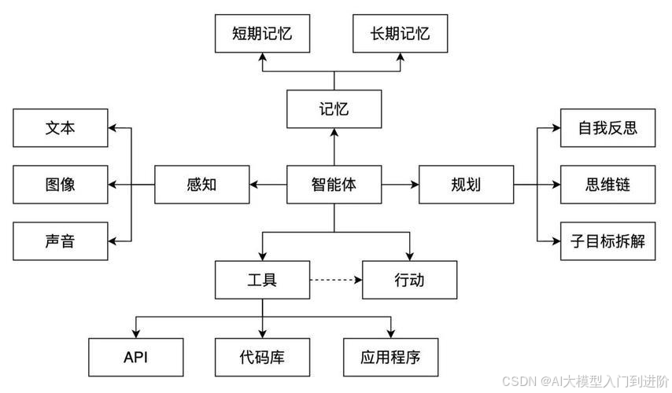

### 与传统 Chatbot 的区别

| 维度 | 传统 Chatbot | AI Agent |
|------|-------------|----------|
| **交互模式** | 一问一答，被动响应 | 自主规划，主动执行 |
| **任务复杂度** | 单轮简单问答 | 多步复杂任务链 |
| **外部能力** | 仅靠模型内部知识 | 调用工具、搜索、执行代码 |
| **记忆** | 会话内短暂记忆 | 长期记忆 + 知识积累 |
| **典型代表** | ChatGPT 早期版本 | Claude Code、Codex、OpenClaw |

> **一句话总结**：如果说传统 LLM 是一个"博学的顾问"，那么 AI Agent 就是一个"能动手的助手"——它不仅知道答案，还能主动去查资料、写代码、调 API，直到把任务彻底完成。

## 现有产品的不同层面

1. 基座模型：GPT5.5、deepseek-v4、 doubaoseed、 GLM-5.2、 claude opus4.8、 claude fable 5
	- 模型如何被调用：本地部署、api、sdk、窗口界面。
		- 本地部署的参数测算
		- 远程使用的注意事项：撞缓存；密码泄露
2. 服务提供商：
	- 原生模型厂商（豆包、腾讯混元、阿里云百炼、智谱AI、月之暗面、DeepSeek等等）
	- 一站式聚合平台（阿里云百炼、火山引擎火山方舟、腾讯云大模型平台、硅基流动 Siliconflow、七牛云 AI、）
	- 海外模型中转平台：cherry in、close AI、API2D、OpenRouter
3. 对话窗口产品：豆包、元宝、千问、chatgpt、gemini
4. 知识库产品：乐享、语雀
5. 智能体产品：
	- 面向代码编辑：Trae、Cursor；
	- 通用智能体：openclaw、hermes、Coze、workbuddy、codex、claude code

## 相关概念解释

### 1.token（词元）

token是大模型的最小计算单元，我们输入对话之后，模型通过分词，切分成token序列，根据输入的token，计算每个token的向量值。输出时根据已有的token预测下一个token。

api token：令牌，相当于访问各种服务的密码。


### 2. harness

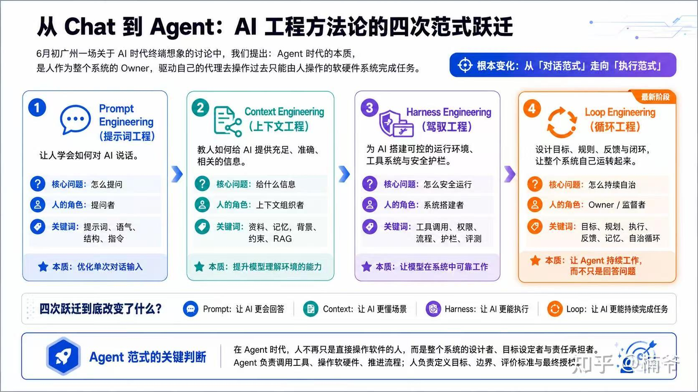
AI工程方法论的四次变迁：

	1. 提示词工程：你是一个熟练的……专家
	2. 上下文工程：把资料、知识库、联网搜索的网页、上下文记忆都喂给AI。
	3. 驾驭工程： harness（马具），如何约束AI的运行环境，规范权限、流程、感知边界、反馈机制。
	   > OpenClaw、OpenCode、Hermes、Codex、Claude Code可以算作是五类不同的Agent Harness 设计范式。
	- OpenClaw：**通用型全栈运行时网关（底层承载底座）**
	- Hermes：**自进化研究型通用 Agent 框架（带持续学习闭环）**
	- Codex（OpenAI）：**模型原生深度耦合编码 Harness（厂商内置绑定）**
	- Claude Code（Anthropic）：**垂直专用终端编程 Agent（闭源产品级工具）**
	- OpenCode：**轻量化开源纯编码 CLI 执行器（可被上层框架调用的子组件）**

| 框架          | Harness 核心范式 | 层级定位       | 主动 / 被动 | 开放度             | 核心取舍                       |
| ----------- | ------------ | ---------- | ------- | --------------- | -------------------------- |
| OpenClaw    | 通用网关运行时      | 上层承载底座     | 主动常驻    | MIT 开源，模型无关     | 通用性、多渠道、本地隐私、可托管其他编码 Agent |
| Hermes      | 自进化研究框架      | 完整通用 Agent | 主动常驻    | MIT 开源，无锁定      | 长期记忆、自迭代、轻量化自托管，编码为插件      |
| OpenCode    | 纯编码 CLI 执行器  | 编码子组件      | 被动单次会话  | 开源多模型           | 极简、只处理代码，作为上层框架的底层执行单元     |
| Codex       | 云端模型一体化      | 厂商内置编码工具   | 被动单次会话  | 闭源 OpenAI 绑定    | 调用便捷、云端沙箱，自定义管控能力弱         |
| Claude Code | 终端专业编码 Agent | 垂直专用产品     | 被动单次会话  | 闭源 Anthropic 绑定 | 本地文件深度集成、强安全审批、大型工程推理      |

- opencode ：纯粹的AI 代码智能体
- openclaw ：将大量聊天软件和市面上的智能体终端连接起来的产品，workbuddy就是基于openclaw的
- Hermes ： 会把用户的所有对话都总结到记忆，可以通过不停对话让它更懂你的习惯。
- codex ： 明确执行边界的项目型AI终端，不同项目互相隔离，工作区和系统隔离，最适合跑小型的独立项目。
- claude code ： 比codex更灵活、生态更丰富的，框架本地封装，适合接入各种程序，

**智能体产品之间也在互相学习和迭代，不需要纠结它们的优缺点，可以选一个先上手**

### 3. mcp

mcp(model context protocol)，模型上下文协议。由 Claude 开发厂商 Anthropic 在 2024 年 11 月开源推出，目前已经成为 AI Agent、本地知识库、大模型调用外部资源的新一代通用工业标准。由host（模型主体）、client（客户端）、sercer（服务端）构成。市面上的mcp有远程和本地两种，提供一个接口，根据这个协议，唤起mcp服务，获取里面的工具。过去的function calling，每一种工具都由厂商自己研发，现在谁都可以开发符合mcp协议的服务，给大模型接入。

启动AI agent时，他会启动所有接入的mcp服务，如果是远程的，就访问远程服务器并建立连接和初始化，如果是本地服务，也是和本地的client建立通信。

一个mcp里可能包含几十上百个工具，模型获取到工具，规划工具，然后注入上下文。

过多的mcp接入会大幅提高token消耗


### 4. skill

把一套固定的流程、约束写成规范。skill里包含技能自身的描述，标签等元数据、一个封装的业务（可以是prompt、一套工作流、包含一定的脚本、一些案例、关于输出内容的结构等等）。

过多的重复的skill，或者描述太过宽泛的skill同样会浪费token


# 从零开始：安装、调用

## 前置

### github

[GitHub](https://github.com/)

### git/git bash

[Git - Install](https://git-scm.com/install/)

- 常用的git命令
	- git init 初始化
	- git status 查看文件状态
	- git clone url 克隆远程仓库
	- git add . 跟踪所有文件
	- git commit 提交文件
	- git branch 分支名 创建一个分支
	- git switch 分支名 切换分支
	- git remote add origin <远程仓库地址>
	- git remote -v
	- git pull origin master --rebase
	- git push -u --tags origin 分支名 上传到云端
	- git tag 给某个版本打标签
	- git revert HEAD 撤销最近一次修改
	- git restore 恢复文件内容


### node.js

[Node.js — 让 JavaScript 无处不在 - Node.js 运行环境](https://node.org.cn/en)
### python

[Download Python | Python.org](https://www.python.org/downloads/)

### 可选：anaconda

[Download Success | Anaconda](https://www.anaconda.com/download/success?reg=skipped)


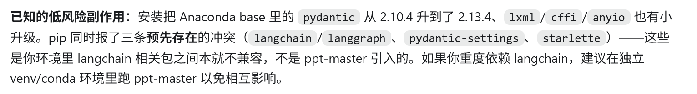
因为随着深度使用，难免遇到环境中的包冲突
### vscode

[Visual Studio Code - The open source AI code editor | Your home for multi-agent development](https://code.visualstudio.com/)

 - vscode中的插件
	 - codex cli
	 - claude code cli
	 - neo4j
	 - sqltools

## Trae

任务：对话
项目：文件夹
内置工具：阅读、编辑、终端、预览、联网搜索
solo 模式：智能体独立完成任务，左侧任务栏，中间对话窗口，右侧智能体各种配置和文件窗口，更适合沉浸在对话和任务中。
IDE模式：编程开发，左侧文件窗口，中间文本编辑器，右侧对话窗口，更适合程序员
不订阅的话可接入自己的模型，不接入模型的话需排队，订阅的话终端分配模型。

Trae吸收了claude code、vscode等优秀的设计，基本该有的功能都有了，基础功能全面，全中文设置比较友好。

问题：状态维护、验证流程还有待加强


## Workbuddy

基于Openclaw架构的国产agent

助理：Openclaw的多应用会话管理
任务：对话窗口
项目：协同空间；文件夹
专家：agent/skill/mcp
自动化：cron，设置定时任务和循环任务
知识库：连接ima等等

新号赠送2000积分，每日可领取100积分，完成任务有额外积分。

问题：openclaw框架的安全边界和安全评估做得不好，有时候为了解决一个问题，模型会用尽一切手段去处理，生成一大堆代码或者修改了很多本地的设置，包括修改系统设置等危险行为。

## agent能力差距的主要要素

### 模型自身的能力

#### 不同模型能力图对比


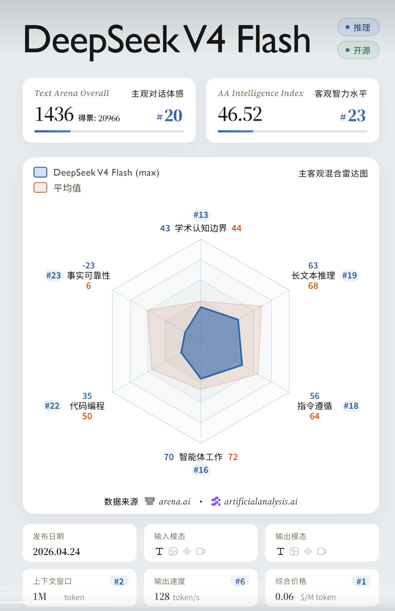

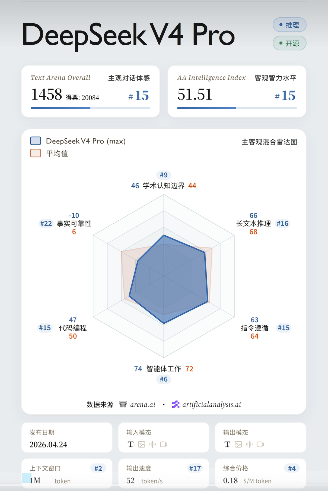

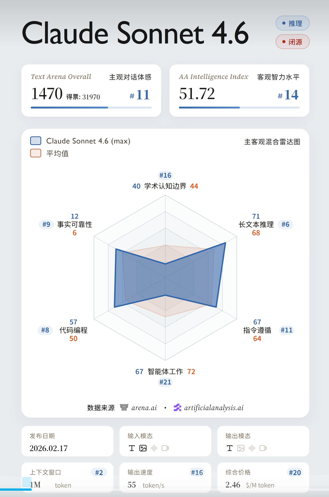

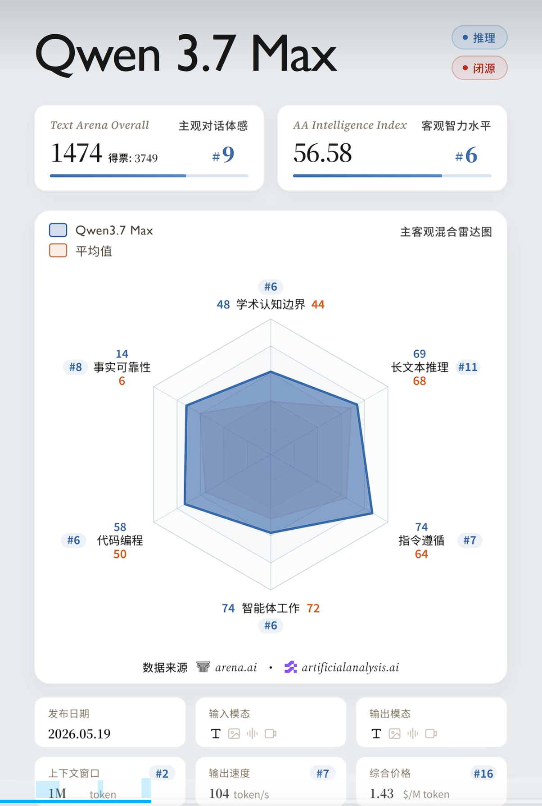

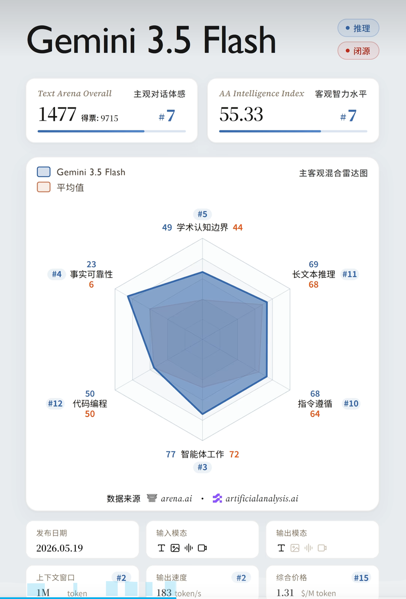


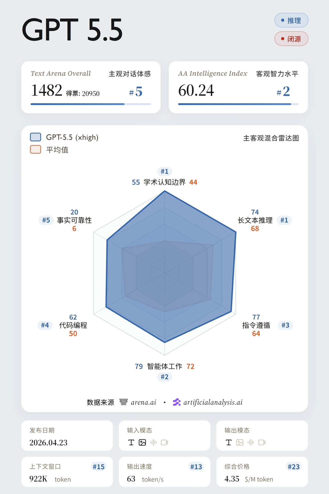


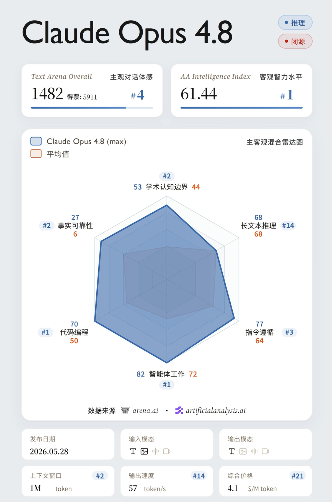

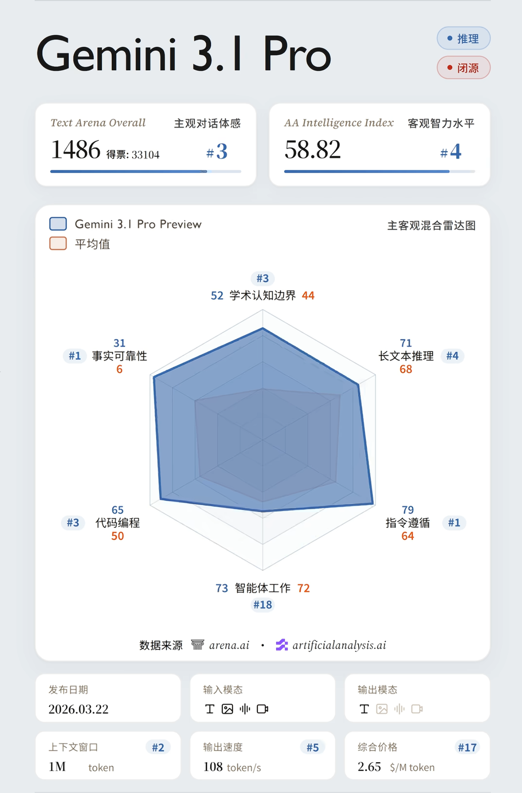

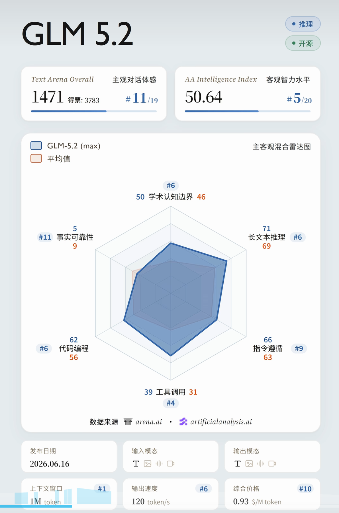

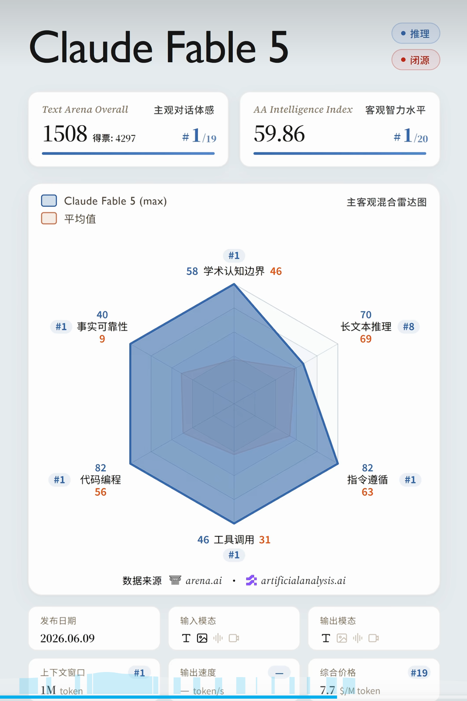


### agent系统的设计

一个 Agent 系统的设计涵盖多个关键维度：用户意图分析、目标（Goal）、规划（Plan）、上下文构建（Context Builder）、函数调用（Function Calling）、技能与 MCP 路由（Skill & MCP Routing）、记忆（Memory）、会话管理（Session Management）、自我评估（Self-Evaluation）、边界设定与约束（Boundaries & Constraints）、验收与修复流程（Verification & Repair），以及多线程并行管理（Multi-threaded Parallelism）等。

设计得当的 Agent，能够高效、准确地执行任务；设计欠佳的 Agent，则容易在多轮会话中出现以下问题：上下文管理失控、工具注入过多导致干扰、感知与路由能力不足而在局部环节反复纠缠——最终造成上下文膨胀，严重拖累模型的推理能力和表现。

claude code + claude opus4.8 > claude code +deepseekv4 pro >trae + deepseek v4 pro

但是 mcp、skill的恰当使用，以及自身的工程规划能力，可以一定程度地弥补这些差距。

---
推荐方案：购买一个codex的plus，同时购买一个国产的coding plan作为补充。

为什么不购买claude code

---

## 大模型的使用

### 本地部署

#### 核心概念：参数、精度与显存的关系

本地部署大模型本质上是在你自己的硬件上运行模型推理。决定能否跑起来的关键因素是 **显存（VRAM）**，它由三个变量共同决定：

##### 1. 模型参数量（Parameters）

模型的"大脑容量"，参数越多，模型通常越聪明，但也越吃资源：

| 量级 | 典型模型 | 参数量 | 定位 |
|------|---------|--------|------|
| **小模型** | Qwen2.5-7B、DeepSeek-7B、Llama-3-8B | 7B~8B | 轻量任务、对话、翻译 |
| **中模型** | Qwen2.5-32B、DeepSeek-V3-Lite、Llama-3-70B | 30B~70B | 复杂推理、代码生成 |
| **大模型** | DeepSeek-V3（671B MoE）、Llama-3-405B | 405B~671B | 顶级推理、多模态 |
| **超大模型** | GPT-5、Claude Opus 4 | 万亿级（未公开） | 目前无法本地部署 |

> **MoE（混合专家）模型注意**：如 DeepSeek-V3 总参数 671B，但每次推理只激活约 37B 参数。显存需要装下全部 671B 的权重，但计算量接近 37B 的水平。

##### 2. 模型精度（Precision / Quantization）

精度决定了每个参数用多少 bit 存储，直接影响显存占用和模型质量：

| 精度                    | 每参数占用           | 说明            | 质量损失    |
| --------------------- | --------------- | ------------- | ------- |
| **FP32**（全精度）         | 4 bytes         | 原始训练精度，推理极少使用 | 无损      |
| **FP16 / BF16**（半精度）  | 2 bytes         | 主流推理精度，质量基本无损 | ≈ 0%    |
| **INT8**（8-bit 量化）    | 1 byte          | 轻度量化，小幅质量下降   | 1~3%    |
| **INT4 / GPTQ 4-bit** | 0.5 bytes       | 重度量化，显著降低显存   | 3~8%    |
| **INT2 / 1.5-bit**    | 0.19~0.25 bytes | 极限量化，质量明显下降   | 10~20%+ |

**精度的权衡逻辑**：
```
显存占用 = 参数量 × 每参数字节数 + 推理开销（KV Cache 等）

FP16  → 质量最高，显存最大
INT8  → 性价比最优，质量几乎不变
INT4  → 消费级硬件首选，质量可接受
INT2  → 极端情况，不推荐日常使用
```

##### 3. KV Cache（推理开销）

除了模型权重本身，推理时还需要额外的显存来存储 **KV Cache**（键值缓存）：

- **取决于**：上下文长度（context length）、模型层数、注意力头数
- **大致范围**：模型权重的 10%~30%
- 上下文越长，KV Cache 越大。128K 上下文比 4K 上下文多消耗数倍显存。

#### 本地部署显存测算表

以下为 **推理（Inference）** 所需显存的粗略估算（不含训练），单位 GB。绿色 = 消费级显卡可跑，黄色 = 需多卡或专业卡，红色 = 极难本地部署。

| 模型参数量          | 精度   | 模型权重    | + KV Cache 开销 | **总需显存**     | 消费级显卡方案                              |
| -------------- | ---- | ------- | ------------- | ------------ | ------------------------------------ |
| **7B**         | INT4 | ~3.5 GB | ~0.8 GB       | **≈ 4.5 GB** | 🟢 RTX 3060 (12G) / RTX 4060 (8G)    |
| **7B**         | INT8 | ~7 GB   | ~1.2 GB       | **≈ 8 GB**   | 🟢 RTX 4060 (8G) 勉强 / RTX 4070 (12G) |
| **7B**         | FP16 | ~14 GB  | ~1.5 GB       | **≈ 16 GB**  | 🟡 RTX 4080 (16G) / RTX 5070         |
| **13B~14B**    | INT4 | ~7 GB   | ~1.5 GB       | **≈ 8.5 GB** | 🟢 RTX 4070 (12G)                    |
| **13B~14B**    | INT8 | ~14 GB  | ~2 GB         | **≈ 16 GB**  | 🟡 RTX 4080 (16G)                    |
| **13B~14B**    | FP16 | ~28 GB  | ~3 GB         | **≈ 31 GB**  | 🔴 RTX 5090 (32G) 勉强 / 需多卡           |
| **32B**        | INT4 | ~16 GB  | ~3 GB         | **≈ 19 GB**  | 🟡 RTX 4090 (24G) / RTX 5090 (32G)   |
| **32B**        | INT8 | ~32 GB  | ~4 GB         | **≈ 36 GB**  | 🔴 需 A6000 (48G) 或双 4090             |
| **32B**        | FP16 | ~64 GB  | ~5 GB         | **≈ 70 GB**  | 🔴 需 A100 (80G) 或 4× RTX 4090        |
| **70B~72B**    | INT4 | ~36 GB  | ~6 GB         | **≈ 42 GB**  | 🔴 需 A6000 (48G) / 双 RTX 4090        |
| **70B~72B**    | INT8 | ~72 GB  | ~8 GB         | **≈ 80 GB**  | 🔴 需 A100 80G                        |
| **70B~72B**    | FP16 | ~144 GB | ~10 GB        | **≈ 155 GB** | 🔴 需 2× H100 / 多卡集群                  |
| **405B**       | INT4 | ~203 GB | ~20 GB        | **≈ 225 GB** | 🔴 需 3× H100 80G                     |
| **671B (MoE)** | INT4 | ~336 GB | ~25 GB        | **≈ 360 GB** | 🔴 需 5× H100 80G / 8× A100 80G       |

> **说明**：
> - 以上为推理专用测算。如果同时训练/LoRA 微调，显存需求大约是推理的 3~4 倍（需要存储梯度、优化器状态）。
> - MoE 模型（如 DeepSeek-V3）总参数量大但激活参数少，显存主要花在存储全部专家权重上，推理速度接近同激活量的密集模型。
> - 使用 `llama.cpp` / `Ollama` 的 GGUF 格式可以部分 offload 到 CPU 内存 + 核显，牺牲速度换取更大的模型。

#### 为什么不建议个人本地部署模型

综合以上分析，对于绝大多数个人用户，**不建议本地部署大模型作为主力使用**，原因如下：

##### 1. 💰 硬件成本高，性价比极低

| 方案                              | 一次性投入     | 能跑的模型               | 体验                    |
| ------------------------------- | --------- | ------------------- | --------------------- |
| RTX 4060 (8G)                   | ~¥2,200   | 7B-INT4             | 勉强可用，推理速度慢            |
| RTX 4090 (24G)                  | ~¥13,000  | 32B-INT4            | 中等体验，模型能力有限           |
| RTX 5090 (32G)                  | ~¥16,000+ | 32B-INT8 / 70B-INT4 | 较好体验，仍远不及云端旗舰         |
| 双 RTX 4090                      | ~¥26,000  | 70B-INT4            | 能跑但功耗惊人               |
| Mac Studio M2 Ultra (192G 统一内存) | ~¥40,000  | 70B-FP16            | 速度慢（内存带宽瓶颈），无 CUDA 生态 |

相比之下，API 调用成本极低：DeepSeek-V3 输入 ¥1/百万 token，输出 ¥2/百万 token。一块 RTX 4090 的钱 ≈ **6500 万 token 的 API 调用**，普通用户几年都用不完。

##### 2. 🧠 模型能力差距巨大

- 你能本地跑的（7B~32B INT4）和云端最强模型（Claude Opus 4、GPT-5、DeepSeek-V4）之间存在 **代际差距**，在复杂推理、代码生成、多模态理解上差距悬殊。
- Agent 场景对模型能力要求极高——需要规划、工具调用、自我纠错。本地小模型在这些方面表现远不及云端旗舰。
- 量化（INT4/INT8）会进一步损失模型质量，尤其是在数学推理和代码生成任务上。

##### 3. ⚡ 功耗、散热、噪音

- RTX 4090 满载功耗 ~450W，双卡 ≈ 900W，相当于一台空调的功耗。
- 持续高负载运行产生大量热量和风扇噪音，不适合放在卧室或工位旁。
- 电费成本：按 0.6 元/度算，24×7 跑一张 4090 每月电费约 ¥200。

##### 4. 🔧 运维门槛高

- 需要折腾 CUDA、cuDNN、PyTorch 版本兼容性。
- 模型下载动辄几十 GB，网络不稳定时体验极差。
- 多用户并发、会话管理、负载均衡等生产环境问题完全需要自己解决。
- 驱动更新、依赖冲突、OOM 崩溃排查耗时耗力。

##### 5. 📉 模型迭代快，硬件迅速贬值

- 模型每 3~6 个月迭代一代，你今天买的显卡刚能跑当前最好的本地模型，半年后可能就跑不动新的了。
- 而云端 API 永远能用最新最强的模型，不需要任何硬件升级。

##### 🎯 唯一值得本地部署的场景

| 场景          | 理由                           |
| ----------- | ---------------------------- |
| **数据绝对隐私**  | 涉密数据、医疗记录、法律文件不能出内网          |
| **离线环境**    | 无网络环境下的嵌入式设备、野外作业            |
| **学习研究**    | 学习模型推理、量化、部署技术本身             |
| **高频小模型任务** | 文本分类、简单翻译、代码补全等轻量任务（7B 以下足够） |
| **企业合规要求**  | 金融、政务等有数据不出域硬性要求的行业          |

> **结论**：对于 95% 以上的个人用户，**API 调用 + 云端 Agent 产品** 是更理性、更经济的选择。把买显卡的钱省下来订阅 Coding Plan 或 API 额度，体验远好于本地折腾。本地部署的"拥有感"是心理价值，实际投入产出比极低。

##### 云端api需要注意的事项

1. 不要上传自己的密钥和隐私
2. 尽量使用官方的api服务，可勾选不提供数据作为训练。
3. 不要使用某些号称提供海外AI服务的中介商

---

**缓存（Cache）与撞缓存现象**

#### 什么是缓存？

在 AI 大模型中，**缓存**指的是将模型处理过的计算结果暂存起来，当再次遇到相同或相似的输入时，直接复用已有结果，而不需要重新计算。

**类比**：就像你把一道复杂数学题的解题过程记在草稿纸上，下次遇到同样的题，直接翻草稿纸就行，不用重新算一遍。

在 LLM 调用中，缓存主要发生在两个层面：

| 层面 | 说明 | 举例 |
|------|------|------|
| **Prompt 缓存** | 对相同前缀的 prompt，复用已计算的注意力矩阵和 KV 值 | 系统提示词（system prompt）每次相同，只计算一次 |
| **上下文缓存** | 长对话中，已处理过的历史消息不再重复计算 | Claude 的 prompt caching：标记 `cache_control` 的块被缓存 |

**缓存的好处**：
- ⚡ **降低延迟**：跳过重复计算，响应更快
- 💰 **降低成本**：缓存命中的 token 通常按折扣价计费（如 Claude 缓存写入按原价，读取按 1/10 价格）
- 🔄 **提升吞吐**：服务端负载降低

#### 什么是"撞缓存"现象？

**撞缓存**（Cache Collision / Cache Poisoning）是指在多用户共享的模型服务中，不同用户的请求因为前缀相同而意外命中同一块缓存，导致：

1. **信息泄露风险**：用户 A 的系统提示词被缓存，用户 B 的请求命中了该缓存，可能看到 A 的上下文片段
2. **行为污染**：前一个用户的对话状态残留在缓存中，影响后续用户的模型输出
3. **调试困惑**：同一个 prompt 在不同时间返回不同结果，因为缓存状态不一致

**为什么会出现？**

```
用户A: [系统提示词A] + "帮我写一封邮件"
         ↓ 缓存了 [系统提示词A] 的计算结果
         
用户B: [系统提示词A] + "总结这份文档"  
         ↓ 命中缓存 → 使用用户A时的缓存状态
         ↓ 如果缓存隔离不严 → 可能掺杂用户A的上下文
```

**注意**：主流模型厂商（OpenAI、Anthropic 等）的缓存是按 API Key 隔离的，正常情况下不会跨用户撞缓存。**撞缓存更多发生在**：
- 自建代理/中转服务（如 API2D、CloseAI 等）缓存策略不当
- 本地部署时多用户共用同一实例
- 使用第三方客户端时，客户端层面的缓存 bug

#### 如何避免撞缓存？

1. **使用官方 API 直连**，减少中间层
2. **避免在中转平台长期使用同一 API Key 跑高频对话**
3. **敏感场景每次新建会话**，不依赖长对话缓存
4. **本地部署时做好用户会话隔离**

---

###  api调用

发送网页请求，提交会话，云端服务处理。像访问网页一样


### sdk工具包

**SDK（Software Development Kit，软件开发工具包）** 是模型厂商提供的一套封装好的代码库，让开发者用编程语言（Python、JavaScript、Java 等）直接调用大模型，而不需要手写底层的 HTTP 请求。

#### SDK 的工作原理

SDK 本质上是对 **REST API** 的一层封装。整个调用链路如下：

```
你的代码
   ↓ 调用 SDK 方法（如 client.chat.completions.create()）
SDK 层
   ↓ 构造 HTTP 请求（拼接 URL、添加认证头、序列化参数）
网络传输
   ↓ HTTPS 请求 → 模型服务器
模型推理
   ↓ GPU/TPU 计算，生成 token
网络返回
   ↓ HTTPS 响应（或 SSE 流式响应）
SDK 层
   ↓ 解析响应、处理流式数据、错误重试
你的代码
   ↓ 拿到结构化的返回结果
```

#### SDK 帮你做了哪些事？

| 功能 | 没有 SDK（手写） | 有 SDK |
|------|-----------------|--------|
| **认证** | 手动在 Header 里加 `Authorization: Bearer sk-xxx` | `client = OpenAI(api_key="sk-xxx")` 一行搞定 |
| **请求构造** | 手写 JSON，注意嵌套结构、字段类型 | 调用函数，IDE 自动补全，类型安全 |
| **流式输出** | 手动解析 SSE（Server-Sent Events）协议 | `stream=True`，`for chunk in stream:` 直接遍历 |
| **错误处理** | 手动判断 HTTP 状态码、解析错误 JSON | SDK 自动抛出对应异常（`RateLimitError`、`AuthenticationError` 等） |
| **重试机制** | 自己写重试逻辑 + 指数退避 | SDK 内置自动重试（如 OpenAI SDK 默认重试 2 次） |
| **Token 计数** | 需要自己调 tokenizer | SDK 提供 `count_tokens()` 等方法 |
| **连接管理** | 手动管理 HTTP 连接池 | SDK 内置连接池复用，减少握手开销 |

#### 主流 SDK 示例

**OpenAI Python SDK（最经典的范式）：**

```python
from openai import OpenAI

# 1. 初始化客户端
client = OpenAI(api_key="sk-xxx", base_url="https://api.openai.com/v1")

# 2. 调用模型（非流式）
response = client.chat.completions.create(
    model="gpt-4o",
    messages=[
        {"role": "system", "content": "你是一个有帮助的助手"},
        {"role": "user", "content": "解释一下SDK是什么"}
    ],
    temperature=0.7,
    max_tokens=1000
)

# 3. 获取结果
print(response.choices[0].message.content)

# 4. 流式调用
stream = client.chat.completions.create(
    model="gpt-4o",
    messages=[{"role": "user", "content": "写一首诗"}],
    stream=True
)
for chunk in stream:
    if chunk.choices[0].delta.content:
        print(chunk.choices[0].delta.content, end="")
```

**Anthropic Python SDK：**

```python
import anthropic

client = anthropic.Anthropic(api_key="sk-ant-xxx")

response = client.messages.create(
    model="claude-sonnet-4-20250514",
    max_tokens=1000,
    system="你是一个有帮助的助手",
    messages=[
        {"role": "user", "content": "解释一下SDK是什么"}
    ]
)
print(response.content[0].text)
```

#### SDK vs API：该用哪个？

| 维度       | 直接调 API             | 用 SDK          |
| -------- | ------------------- | -------------- |
| **上手难度** | 需要理解 HTTP、JSON、认证机制 | 装个包，看文档，几行代码跑通 |
| **灵活性**  | 完全控制请求的每个细节         | 受限于 SDK 封装的程度  |
| **开发效率** | 低，重复造轮子             | 高，开箱即用         |
| **维护成本** | 接口变更需要手动适配          | SDK 升级即可（厂商维护） |
| **适合场景** | 自定义需求极强、SDK 不支持的语言  | 日常开发、快速原型、生产环境 |

> **建议**：绝大多数情况下直接用官方 SDK。只有 SDK 不支持的场景（如使用小众编程语言、需要自定义网络层）才考虑手写 API 调用。国内厂商（豆包、千问、DeepSeek 等）大多兼容 OpenAI SDK 的接口格式，可以无缝切换。

#### 关键注意事项

1. **API Key 安全**：永远不要把 key 硬编码在代码里。用环境变量（`os.environ.get("OPENAI_API_KEY")`）或 `.env` 文件管理。
2. **base_url**：使用中转平台或国产模型时，需要把 `base_url` 指向对应地址。例如硅基流动：`base_url="https://api.siliconflow.cn/v1"`。
3. **流式输出**：对于长文本生成，务必使用 `stream=True`，否则用户要等很久才能看到第一个字。
4. **异常处理**：生产环境务必 `try/except` 捕获 `RateLimitError`（限流）、`APITimeoutError`（超时）等。
### 客户端软件（仅需登录和填写自己的api和token）


所以有一种说法，说不用着急学习AI，产品会自己降低使用门槛来找你的。当然，对于我们来说，早点使用，形成习惯和提高日常效率也已经足够了。

## 模型服务的购买

- 充值，以硅基流动为例
- [硅基流动统一登录](https://account.siliconflow.cn/zh/login?redirect=https%3A%2F%2Fcloud.siliconflow.cn%2Fme%2Fmodels%3F)
- 
- coding plan：
	  - 火山方舟
		  - [火山方舟 - Agent Plan](https://console.volcengine.com/ark/region:cn-beijing/subscription/agent-plan)
	  - 智谱
		  - [智谱AI开放平台](https://open.bigmodel.cn/glm-coding)
	  - 阿里云百炼
		  - [阿里云百炼 Token Plan](https://www.aliyun.com/benefit/scene/tokenplan?spm=5176.30260724.0.0.15c732a5x3zSkr)
	  - 腾讯云
		  - [腾讯云大模型Token Plan_畅享龙虾和编码自由](https://cloud.tencent.com/act/pro/tokenplan)

---
有项目的老师可以去申请企业认证，开发票报销；报销时需说明AI开支合理性

---

## codex

### 注册

- 梯子

- google海外账号
	- 手机注册
	- 全程开节点，半夜或者人少的时间段成功率更高
	- 没用过的大陆手机号；用香港的手机号成功率更高

### 订阅

- 梯子
- 手机下载chatgpt（google play或apple商店）
- 登录chatgpt
- visa信用卡（国内国外均可），绑定google play或apple
- 非华为安卓手机：google play商店（注意修改地区，不要是中国）
- 苹果手机：apple pay
- plus：20美元；pro：100美元。pro*20：400美元
- 

# Codex的调试和使用

## 插件

- computer use
- chrome：必须是美、日节点才可以下载安装。
- 办公软件
- zotero
- github

## mcp

MCP（Model Context Protocol）服务是 AI Agent 连接外部世界的"感官和手脚"。每个 MCP 服务提供一组**工具（Tools）**，Agent 可以根据任务需求自主选择和调用。以下介绍 Codex 中常用的 6 个 MCP 服务。

---

### 1. Brave Search（网络搜索）

**定位**：为 AI Agent 提供全面的互联网搜索能力。

Brave Search MCP 是由 Brave 官方维护的 MCP 服务，基于 Brave Search API，让 Agent 能够自主进行网络搜索。它是 MIT 开源的，支持 STDIO 和 HTTP 两种传输模式。

**提供的工具：**

| 工具                   | 功能                                  |
| -------------------- | ----------------------------------- |
| `brave_web_search`   | 通用网页搜索，支持按国家、语言、时效性、安全等级过滤          |
| `brave_local_search` | 本地商户/地点搜索，返回评分、营业时间、AI 描述（需 Pro 套餐） |
| `brave_video_search` | 视频搜索，返回元数据和缩略图                      |
| `brave_image_search` | 图片搜索，返回 URL、尺寸、置信度（最多 200 条）        |
| `brave_news_search`  | 新闻搜索，支持时效性控制和突发新闻标记                 |
| `brave_summarizer`   | AI 摘要，基于搜索结果生成智能总结                  |
| `brave_place_search` | POI 兴趣点搜索，按坐标或地名返回结构化地点数据           |
| `brave_llm_context`  | 为 LLM 和 RAG 管线优化的预提取网页内容            |

**使用方式：**

```json
{
  "command": "npx",
  "args": ["-y", "@brave/brave-search-mcp-server"],
  "env": { "BRAVE_API_KEY": "你的API密钥" }
}
```

> **免费获取 API Key**：在 [Brave Search API 控制台](https://api.search.brave.com/) 注册，免费套餐每月有一定额度。付费套餐（Search 计划）解锁更多功能和更高频率。

**典型场景**：让 Agent 查资料、验证事实、搜索最新文档、对比方案等。

---

### 2. Context7（实时文档查询）

**定位**：解决 LLM 训练数据过时导致的"幻觉 API"问题——让 Agent 能查到最新的库文档和代码示例。

Context7 是由 Upstash 开发的开源平台（MIT 许可），专门为 AI 编程工具提供**版本匹配的实时文档**。它的核心价值在于：当你让 Agent 用某个库写代码时，Context7 会拉取该库**当前版本**的官方文档，而不是依赖模型训练时记住的旧 API。

**提供的工具：**

| 工具 | 功能 |
|------|------|
| `resolve-library-id` | 根据库名和查询意图，解析出 Context7 中的库标识符（如 `/vercel/next.js`） |
| `query-docs` | 根据库标识符和具体问题，检索版本匹配的文档和代码示例 |

**核心特性：**

- **版本自动匹配**：提到 "Next.js 14" 会自动检索 v14 对应文档，而非最新或旧版
- **斜杠语法直达**：可直接指定 `/supabase/supabase` 跳过匹配步骤
- **一键安装**：`npx ctx7 setup` 自动完成 OAuth 认证、API Key 生成、MCP 配置
- **社区共建**：文档库由社区贡献，覆盖面持续增长

**使用方式：**

```json
{
  "command": "npx",
  "args": ["-y", "@upstash/context7-mcp"],
  "env": { "CONTEXT7_API_KEY": "你的API密钥" }
}
```

> **免费获取 API Key**：在 [Context7 控制台](https://context7.com/dashboard) 注册，免费 Key 有更高速率限制。

**典型场景**：写代码时自动查最新 API、避免使用已废弃的方法、获取准确的代码示例。

---

### 3. Fetch（网页内容抓取）

**定位**：让 Agent 能够获取任意网页的内容并转换为可读格式。

Fetch MCP 是 MCP 官方参考服务器之一，功能简洁但极其实用——将任何 URL 的内容抓取下来，把 HTML 转换为 Markdown 格式，方便 LLM 阅读和处理。

**提供的工具：**

| 工具 | 功能 |
|------|------|
| `fetch` | 抓取 URL 内容并返回 Markdown 格式文本 |

**参数说明：**

| 参数 | 说明 | 默认值 |
|------|------|--------|
| `url` | 要抓取的网址（必填） | — |
| `max_length` | 返回内容的最大字符数 | 5000 |
| `start_index` | 起始字符位置（支持分段读取长网页） | 0 |
| `raw` | 是否返回原始 HTML（不转 Markdown） | false |

**核心特性：**

- **分块读取**：通过 `start_index` 参数，可以像翻书一样逐段读取长网页
- **Markdown 转换**：自动将 HTML 转为 Markdown，去除广告和排版噪声
- **robots.txt 遵守**：默认遵守网站的爬虫协议（可通过 `--ignore-robots-txt` 关闭）
- **自定义 User-Agent**：可配置请求头标识
- **代理支持**：可通过 `--proxy-url` 配置代理

**安装方式：**

```bash
# 推荐方式（uvx）
uvx mcp-server-fetch

# 或 pip
pip install mcp-server-fetch
```

> ⚠️ **安全提醒**：Fetch 可以访问本地/内网 IP，需注意安全风险。生产环境建议配置网络隔离。

**典型场景**：抓取在线文档、阅读技术文章、获取 API 文档、提取网页中的关键信息。

---

### 4. GitHub（代码仓库管理）

**定位**：让 Agent 直接操作 GitHub 仓库——搜索代码、管理 Issue/PR、读写文件。

GitHub MCP 是 MCP 官方参考服务器之一，将 GitHub API 封装为一组工具，让 Agent 能够在你的授权范围内自主管理 GitHub 仓库。它是代码 Agent（如 Codex、Claude Code）的核心基础设施。

**提供的工具（部分）：**

| 工具类别 | 典型工具 | 功能 |
|----------|---------|------|
| **仓库管理** | `search_repositories`、`create_repository`、`fork_repository` | 搜索、创建、Fork 仓库 |
| **文件操作** | `get_file_contents`、`create_or_update_file`、`push_files` | 读写文件、批量推送 |
| **Issue 管理** | `create_issue`、`search_issues`、`update_issue`、`add_issue_comment` | Issue 的全生命周期管理 |
| **PR 管理** | `create_pull_request`、`search_pull_requests`、`merge_pull_request` | 创建、搜索、合并 PR |
| **代码搜索** | `search_code`、`search_commits` | 搜索代码内容和提交记录 |
| **分支管理** | `create_branch`、`get_branch`、`delete_branch` | 分支的增删查 |

**核心特性：**

- **细粒度权限控制**：通过 GitHub Personal Access Token 精确控制 Agent 能访问哪些仓库和操作
- **支持 GitHub Enterprise**：可用于私有部署的 GitHub 实例
- **完整的 Git 操作链**：从创建分支、编辑文件到提交 PR，Agent 可完成完整工作流

**使用方式：**

```json
{
  "command": "npx",
  "args": ["-y", "@modelcontextprotocol/server-github"],
  "env": { "GITHUB_PERSONAL_ACCESS_TOKEN": "ghp_xxxxxxxxxxxx" }
}
```

> **获取 Token**：GitHub → Settings → Developer settings → Personal access tokens → Fine-grained tokens。建议只授予必要的仓库和权限。

**典型场景**：自动修复 Bug 并提交 PR、跨仓库搜索代码、生成 Release Notes、管理 Issue 工作流。

---

### 5. Node REPL（JavaScript 代码执行）

**定位**：为 Agent 提供 JavaScript/Node.js 的交互式执行环境。

Node REPL MCP 让 Agent 能够直接运行 JavaScript 代码片段并获取执行结果。当 Agent 需要验证代码逻辑、进行数据计算、测试表达式时，不必"凭空想象"输出，而是真正执行代码并观察结果。

**提供的工具：**

| 工具 | 功能 |
|------|------|
| `execute` | 在 Node.js 环境中执行一段 JavaScript 代码，返回输出结果 |

**核心特性：**

- **真实执行环境**：代码在真实的 Node.js 进程中运行，而非模拟
- **即时反馈**：Agent 写代码 → 执行 → 看结果 → 修正，形成闭环
- **支持异步**：可以使用 `async/await` 语法
- **轻量安全**：运行在沙箱化环境中，适合快速验证

**使用方式：**

```json
{
  "command": "npx",
  "args": ["-y", "node-repl-mcp"]
}
```

> 需要本地安装 Node.js 环境（建议 v18+）。

**典型场景**：验证正则表达式、测试算法逻辑、数据格式转换验证、调试 JavaScript 代码片段、执行数学计算。

---

### 6. Zotero MCP（文献管理集成）

**定位**：将 AI Agent 与 Zotero 文献管理器深度集成，实现文献的自动检索、管理、阅读和综述。

Zotero MCP 是社区开发的 MCP 服务，连接你的 Zotero 文献库，让 Agent 能够像管理文件一样管理学术文献。对于科研工作者和学生来说，这是最有价值的 MCP 之一。

**提供的工具（典型）：**

| 工具类别 | 典型工具 | 功能 |
|----------|---------|------|
| **文献检索** | `search_items`、`search_collections` | 在你的 Zotero 库中搜索文献和分类 |
| **文献管理** | `create_item`、`update_item`、`delete_item` | 创建、更新、删除文献条目 |
| **附件管理** | `get_attachment`、`download_attachment` | 获取和下载 PDF 附件 |
| **笔记管理** | `get_notes`、`create_note` | 读写文献笔记 |
| **标签管理** | `add_tag`、`remove_tag`、`search_by_tag` | 按标签组织和检索文献 |
| **元数据提取** | `get_item_metadata` | 提取文献的标题、作者、摘要等元数据 |

**核心特性：**

- **本地 Zotero 集成**：通过 Zotero Local API 或 Web API 连接你的文献库
- **自动文献检索**：Agent 可以根据研究主题自动在 Zotero 库中查找相关文献
- **文献综述辅助**：Agent 可以读取多篇文献的摘要和笔记，自动撰写综述
- **OCR 联动**：配合 MinerU 等 OCR 工具，可实现古籍/扫描文献的数字化处理

**使用方式：**

```json
{
  "command": "npx",
  "args": ["-y", "zotero-mcp"],
  "env": {
    "ZOTERO_API_KEY": "你的Zotero API密钥",
    "ZOTERO_USER_ID": "你的Zotero用户ID"
  }
}
```

> **获取 API Key**：Zotero → Settings → Feeds/API → Create new private key。需要开启相应的读写权限。

**典型场景**：自动整理文献库、按主题检索相关论文、批量提取文献摘要、辅助撰写文献综述、与 OCR 工具联动处理古籍文献。

---

### 小结：MCP 服务的选用原则

| 原则       | 说明                                                |
| -------- | ------------------------------------------------- |
| **按需接入** | 不是越多越好——每个 MCP 的工具体系都会注入上下文，过多会挤占 token 预算        |
| **同类择优** | 例如搜索类有 Brave Search 和 WebSearch，选一个最适合的即可         |
| **注意权限** | GitHub、Zotero 等服务涉及你的私有数据，务必使用最小权限 Token          |
| **关注延迟** | 远程 MCP 服务（如 Context7、Brave Search）每次调用都有网络延迟，合理使用 |
| **版本更新** | MCP 生态快速迭代，定期检查所用 MCP 是否有新版本或更好的替代品               |

## skill

1. 常用的热门技能
	- superpower
	- ui-uv-pro-max
	- find skills
	- skill creator
	- frontend-slides
	- ppt-master

2. 知网学术技能
	- 学术论文检索
	[anon-research-tools/academic-literature-route: 用于建立可追溯文献检索路线的 Codex 学术论文搜索 Skill](https://github.com/anon-research-tools/academic-literature-route)
	- cnki-watch：
	[CNKI Watch — ClawHub](https://clawhub.ai/yjli-new/skills/cnki-watch)
	- cnki-skills：包括基础检索、高级检索、解析检索结果、提取知网论文详情、下载pdf、导出题录等技能
	https://github.com/cookjohn/cnki-skills

3. 根据我自己的需求开发的技能
	- 拆分pdf并且导入到zotero
	- 
	- 

## codex的配置

Codex 的核心配置由四个关键文件组成，它们共同定义了 Codex 的行为、身份认证和会话管理。

### 1. AGENTS.md —— 项目指令与规范文件

**作用**：AGENTS.md 是 Codex 的"项目说明书"。它让你为 Codex 提供**持久化的项目指令和上下文**。每次 Codex 开始工作时，它会自动读取 AGENTS.md，从而让团队在每个任务开始时都能获得一致的规范。

**发现机制（三级优先级链）**：

1. **全局作用域**：Codex 首先检查 Codex 主目录（默认 `~/.codex`）中的 `AGENTS.override.md`，如果不存在则读取 `AGENTS.md`。只使用第一个非空文件。
2. **项目作用域**：从项目根目录（通常是 Git 根目录）向下遍历到当前工作目录。在每个目录中依次检查 `AGENTS.override.md` → `AGENTS.md` → 后备文件名。
3. **合并顺序**：文件从根目录向下拼接，越接近当前目录的文件越靠后，因此可以**覆盖**前面的指令。

**文件格式**：标准 Markdown，通常包含二级标题和要点规则。

**示例**：

```markdown
# AGENTS.md

## 工作约定

- 修改 JavaScript 文件后必须运行 `npm test`
- 安装依赖时优先使用 `pnpm`
- 添加新的生产依赖前需要确认

## 仓库规范

- 提交 PR 前运行 `npm run lint`
- 修改公共工具函数时同步更新 `docs/` 中的文档
```

**自定义后备文件名**：如果项目使用不同的文件名约定，可以在 `config.toml` 中配置：

```toml
project_doc_fallback_filenames = ["TEAM_GUIDE.md", ".agents.md"]
project_doc_max_bytes = 65536  # 默认 32 KiB
```

**CODEX_HOME 配置文件**：通过设置 `CODEX_HOME` 环境变量，可以为不同场景使用不同的指令配置：

```bash
CODEX_HOME=$(pwd)/.codex codex exec "列出当前激活的指令来源"
```

**注意事项**：
- 空文件会被跳过
- 合并后的内容超过 `project_doc_max_bytes`（默认 32 KiB）会被截断
- 没有缓存机制——每次运行或 TUI 会话启动时重新构建指令链
- 排查问题时可用 `codex status` 验证工作区根目录，或启用 TUI 日志 `codex -c log_dir=./.codex-log`

---

### 2. config.toml —— 主配置文件

**作用**：`config.toml` 是 Codex 的**核心配置文件**，控制几乎所有行为：模型选择、审批策略、沙箱安全、MCP 服务器、TUI 界面、会话历史等。

**位置与优先级（从高到低）**：

1. CLI 参数和 `--config` 覆盖
2. 项目配置：`.codex/config.toml`（仅受信任项目，最近工作目录优先）
3. 配置文件：`~/.codex/配置文件名称.config.toml`（通过 `--profile` 选择）
4. 用户配置：`~/.codex/config.toml`
5. 系统配置：`/etc/codex/config.toml`（Unix）
6. 内置默认值

**核心配置项分类**：

#### 模型与推理
```toml
model = "gpt-5.5"                        # 默认模型
model_reasoning_effort = "high"           # 推理深度：minimal/low/medium/high/xhigh
model_reasoning_summary = "auto"          # 推理摘要：auto/concise/detailed/none
model_verbosity = "medium"                # 输出详细度：low/medium/high
service_tier = "flex"                     # 服务层级：flex/fast
```

#### 审批与安全
```toml
approval_policy = "on-request"            # 审批策略：untrusted/on-request/never
sandbox_mode = "workspace-write"          # 沙箱模式：read-only/workspace-write/danger-full-access
default_permissions = ":workspace"        # 权限配置：:read-only/:workspace/:danger-full-access
```

#### 会话与历史
```toml
[history]
persistence = "save-all"                  # 会话保存：save-all/none
max_bytes = 104857600                     # 历史文件最大字节数
```

#### MCP 服务器配置
```toml
[mcp_servers.my_server]
command = "python"
args = ["-m", "my_mcp_server"]
startup_timeout_sec = 15
enabled_tools = ["tool1", "tool2"]

[mcp_servers.http_server]
url = "https://example.com/mcp"
bearer_token_env_var = "MCP_TOKEN"
```

#### 自定义模型供应商
```toml
[model_providers.azure]
base_url = "https://your-resource.openai.azure.com"
env_key = "AZURE_OPENAI_API_KEY"
query_params = { api-version = "2024-10-21" }
wire_api = "responses"

[model_providers.ollama]
base_url = "http://localhost:11434/v1"
```

#### 环境变量控制
```toml
[shell_environment_policy]
inherit = "all"                           # all/core/none
include_only = ["PATH", "HOME"]           # 白名单模式
exclude = ["*SECRET*", "*TOKEN*"]         # 排除敏感变量
```

#### 网络与沙箱网络
```toml
[features.network_proxy]
enabled = true
domains = { "*.openai.com" = "allow", "*.github.com" = "allow" }
```

#### 功能开关
```toml
[features]
hooks = true                              # 生命周期钩子
multi_agent = true                        # 多智能体协作
memories = false                          # 记忆功能
undo = false                              # 撤销支持
personality = true                        # 人格控制
codex_git_commit = false                  # Codex 生成 git commit
```

#### TUI 界面
```toml
[tui]
theme = "monokai"
animations = true

[tui.keymap.global]
open_transcript = "ctrl-t"

[tui.keymap.composer]
submit = ["enter", "ctrl-m"]
```

#### 项目信任
```toml
[projects]
"/home/user/work/project-a".trust_level = "trusted"
"/tmp/random-repo".trust_level = "untrusted"
```

#### Agent 配置
```toml
[agents]
max_threads = 6                           # 最大并发 agent 线程
max_depth = 1                             # 最大嵌套深度
job_max_runtime_seconds = 1800            # agent 任务超时

[agents.reviewer]
description = "Reviews code changes for quality and security"
```

#### 记忆系统
```toml
[memories]
generate_memories = true
use_memories = true
max_rollout_age_days = 30
min_rollout_idle_hours = 6
```

---

### 3. auth.json —— 身份认证文件

**作用**：`auth.json` 是 Codex 的**身份凭证缓存文件**。它存储访问令牌（access token），让 Codex 能够以你的身份调用 OpenAI API 或 ChatGPT 服务。CLI 和 IDE 扩展共享此文件——在任一端登出，另一端也需要重新登录。

**位置**：`~/.codex/auth.json`（默认），或由 `cli_auth_credentials_store` 配置决定存储方式。

**认证方式**：

| 方式             | 说明                                                           |
| -------------- | ------------------------------------------------------------ |
| **ChatGPT 登录** | 默认方式，打开浏览器完成登录。提供 Plus/Pro/Business/Edu/Enterprise 订阅访问      |
| **API Key 登录** | 从 [OpenAI 平台](https://platform.openai.com/api-keys) 获取，按用量计费 |

**凭证存储位置控制**：

```toml
cli_auth_credentials_store = "keyring"    # file / keyring / auto
```

- **`file`**：存储在 `~/.codex/auth.json`（明文）
- **`keyring`**：存储在操作系统凭证管理器
- **`auto`**：优先使用系统凭证管理器，不可用时回退到文件

**安全警告**：⚠️ **像密码一样对待 `auth.json`**——它包含访问令牌。不要提交到 git、粘贴到工单、或在聊天中分享。

**Token 自动刷新**：ChatGPT 会话的 token 会在使用中自动刷新，活跃会话通常无需重新登录。

**无头/远程机器登录方案**：

1. **设备码认证**（Beta）：运行 `codex login --device-auth`，在浏览器中输入一次性代码
2. **复制 auth.json**：在有浏览器的机器上完成登录，将 `auth.json` 复制到远程机器
   ```bash
   ssh user@remote 'mkdir -p ~/.codex && cat > ~/.codex/auth.json' < ~/.codex/auth.json
   ```
3. **SSH 端口转发**：`ssh -L 1455:localhost:1455 user@remote`，然后运行 `codex login`

**企业管控**：管理员可限制登录方式：
```toml
forced_login_method = "chatgpt"           # 或 "api"
forced_chatgpt_workspace_id = "uuid"      # 限制到特定工作区
```

---

### 4. Session —— 会话管理

**作用**：Session（会话）是 Codex 的**对话记录和状态管理系统**。它不是单一文件，而是 `~/.codex/sessions/` 目录下的一组文件集合。每个会话保存完整的对话记录（transcript）、计划历史（plan history）和审批状态（approvals），让你可以随时恢复之前的工作。

**会话存储**：

- 位置：`~/.codex/sessions/`
- 每个会话有唯一标识符（UUID，如 `7f9f9a2e-1b3c-4c7a-9b0e-...`）
- 包含完整的对话转录、计划历史和审批记录

**恢复会话的方式**：

| 命令 | 作用 |
|------|------|
| `codex resume` | 启动交互式选择器，浏览最近的会话 |
| `codex resume --last` | 快速恢复当前目录最近一次会话 |
| `codex resume --last --all` | 恢复所有目录中最近一次会话 |
| `codex resume <SESSION_ID>` | 直接恢复指定会话 |
| `codex resume --all` | 显示所有目录的会话（不只是当前目录） |

**非交互式恢复**（自动化/脚本）：
```bash
codex exec resume --last "修复你发现的竞态条件"
codex exec resume 7f9f9a2e-1b3c-4c7a-9b0e-.... "实现这个计划"
```

**会话内操作**：

| 操作 | 快捷键/命令 | 说明 |
|------|------------|------|
| 清屏 | `/clear` | 清除终端并开始新对话 |
| 纯清屏 | `Ctrl+L` | 清屏但不结束对话 |
| 退出 | `Ctrl+C` 或 `/exit` | 关闭交互式会话 |
| 搜索历史 | `Ctrl+R` | 搜索提示词历史 |
| 浏览草稿 | `↑` / `↓` | 恢复之前的草稿文本和图片 |
| 编辑上条消息 | `Esc Esc`（空输入框） | 编辑上一条用户消息，重复按可继续回溯 |
| 分支对话 | 编辑后按 `Enter` | 从编辑点分叉新对话 |

**会话历史配置**：
```toml
[history]
persistence = "save-all"    # 保存所有会话 / "none" 不保存
max_bytes = 104857600       # 限制历史文件大小，超出后删除最早记录
```

**会话上下文保持**：每次恢复的会话保留原始转录、计划历史和审批记录，Codex 可以**利用之前的上下文**同时接受新指令。可以通过 `--cd` 覆盖工作目录或 `--add-dir` 添加额外根目录。

**会话可见性**：在 TUI 中，你可以实时观察 Codex 在做出更改前解释计划，并逐步骤批准或拒绝。TUI 始终显示 Codex 操作的转录，便于通过标准 git 工作流进行审查和回滚。
## cc-switch

[CC Switch 官方网站 - AI 编程工具统一管理平台](https://www.ccswitch.io/zh/)

[CC Switch 官方网站 - AI 编程工具统一管理平台](https://www.ccswitch.io/zh/)

### 基础配置

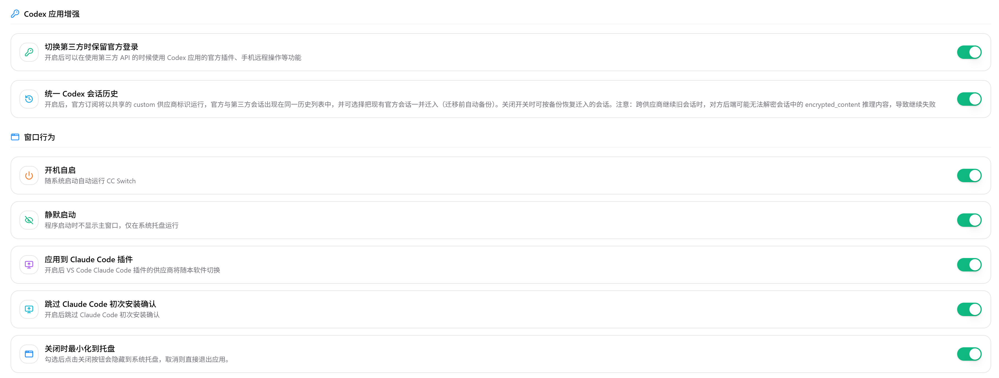

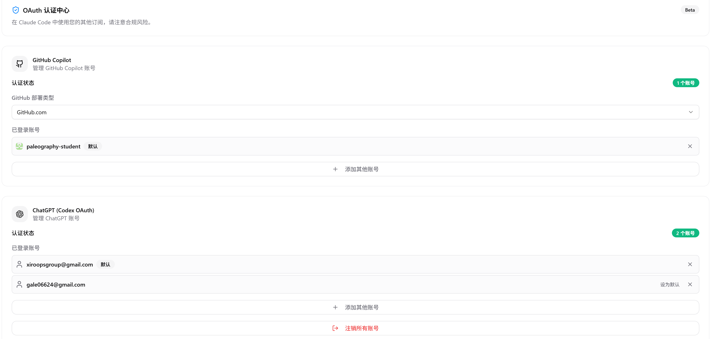

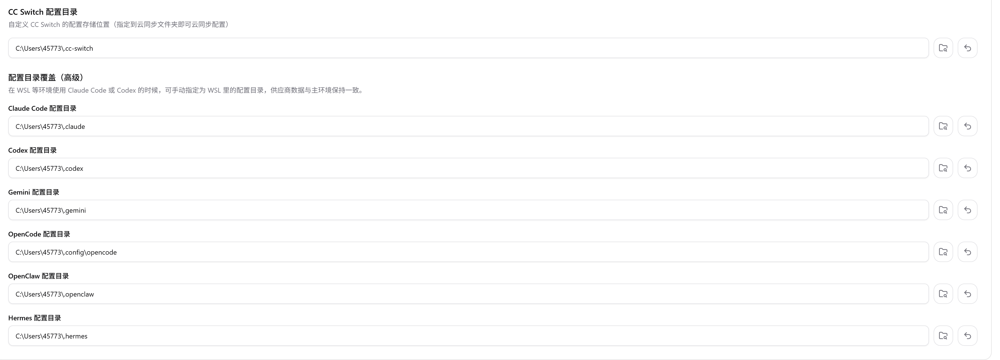

### 配置供应商

#### GLM

#### 火山方舟

根据端点看用什么类型的会话
chat/completions
responses

### skill和mcp管理

一键导入、自行安装、跨平台同步

### config.toml配置


# codex使用案例

## 写代码、网页开发、数据库开发、管理电脑、修电脑

### vibe coding

**Vibe Coding** 是由前 OpenAI、特斯拉 AI 负责人 **Andrej Karpathy** 在 2025 年初提出的一个编程新范式。核心理念是：**"最热门的编程语言是英语"**。

#### 什么是 Vibe Coding？

Vibe Coding 指的是一种全新的编程方式——开发者不再逐行手写代码，而是用自然语言描述自己想要什么，让 AI（如 Claude、GPT、Cursor 等）来生成代码。整个过程更像是一种"感觉流"（vibe）：你和 AI 对话，描述意图，AI 产出代码，你运行、测试、反馈，再继续迭代。

> Karpathy 的原话大意："我完全沉浸在 vibe 里，拥抱 LLM，忘记代码的存在。我只是描述我想要什么，AI 帮我做出来。"

#### 核心特征

1. **意图驱动**：你说"我要一个带搜索功能的资源导航页"，而不是思考用 React 还是 Vue、怎么布局
2. **AI 生成代码**：大模型负责将自然语言意图翻译成可运行的代码
3. **快速迭代**：不满意就继续对话修改，像聊天一样调代码
4. **降低门槛**：非程序员也能"写"出能用的软件

#### Vibe Coding vs 传统编程

| 维度 | 传统编程 | Vibe Coding |
|------|----------|-------------|
| 输入 | 精确的代码语法 | 自然语言描述 |
| 思维模式 | 先想清楚怎么实现 | 先描述想要什么效果 |
| 迭代速度 | 改代码 → 编译 → 调试 | 对话 → 生成 → 运行 |
| 适用场景 | 生产级系统、底层逻辑 | 原型验证、工具脚本、个人项目 |
| 可控性 | 完全掌控每一行 | 需要审查 AI 输出 |

#### 优势

- **效率极高**：原型开发从几天缩短到几小时甚至几分钟
- **降低认知负荷**：不需要记住所有 API 和语法细节
- **探索性强**：快速试错，想到什么试什么
- **赋能非技术人员**：产品经理、设计师也能直接"写"出可用的 demo

#### 风险与挑战

- **代码质量参差不齐**：AI 可能生成有 bug、不安全或不可维护的代码
- **"黑盒"问题**：如果开发者不理解生成的代码，出了问题难以排查
- **不适合复杂系统**：大型项目的架构设计、性能优化仍需专业判断
- **安全风险**：AI 可能引入漏洞或不安全的依赖

#### 最佳实践

1. **理解生成的代码**：不要盲目信任 AI 输出，至少要能读懂
2. **小步迭代**：一次只让 AI 做一件事，逐步构建
3. **版本控制**：用 Git 追踪每一次 AI 生成的变化
4. **AI 辅助 + 人工审查**：AI 写代码，人做 Code Review
5. **从简单场景开始**：先用 Vibe Coding 做工具脚本、原型，积累经验后再用于复杂场景

#### 与 Codex / Claude Code 的关系

Vibe Coding 正是 Codex、Claude Code、Cursor、Windsurf 等 AI 编程工具的核心理念体现。这些工具让你在终端或 IDE 中直接用自然语言指挥 AI 写代码、改 bug、部署项目——你负责"说"，AI 负责"做"。你当前正在使用的 Claude Code 就是 Vibe Coding 的典型实践工具。

### 网页开发

https://www.wenxianxue.cn/ 模拟这个网站，开发一个本地运行的资源导航网页，网页中的数据维护通过建一个本地的sqlite来维护

### 数据库开发

sqlite、mysql、neo4j

tips：
1.不要只想用一个简单的提示词描述你的心目中理想的成果，尝试先和agent沟通出你想要的方案，用确定的路线去指挥它，把输出收敛
2.用项目文件和git去维护一个vibe coding产品，维护一个AGENTS.md、handoff.md、README.md
3.任务解耦，让AI分步执行，效果可能会更好


### 管理电脑

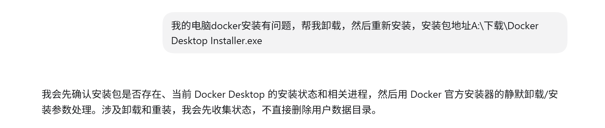

## skill开发：撰写古文字提要

plan模式
20260702AI智能体实战相关提示词


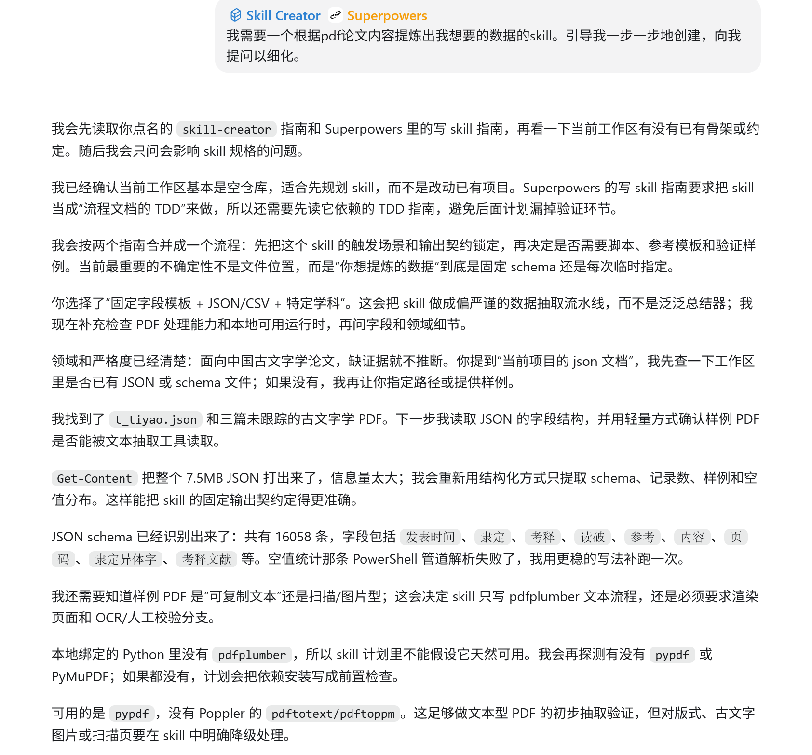


## 古籍OCR、文献OCR


### minerU

[MinerU | 面向 Agent 和 RAG 的智能文档解析平台](https://mineru.net/)


### 接入大模型

api调用

[火山方舟 - Agent Plan](https://console.volcengine.com/ark/region:cn-beijing/subscription/agent-plan)

[模型广场 - TokenHub - 控制台](https://console.cloud.tencent.com/tokenhub/models/detail?modelId=hy-vision-2.0-instruct&regionId=1&from=featured)
web使用

[腾讯混元](https://aistudio.tencent.com/visual)


190款古籍OCR工具大PK：谁是王者？谁是青铜？

假如你有一本古籍的pdf：
1. 让AI帮你拆分成单张的图片并命名好顺序。

2. 创建一个文件夹，把全部古籍图片放一起，拉到codex

3. 让codex写一个脚本并运行，遍历图片，请求OCR服务，获取OCR结果，本地写入


如果你有大量的pdf需要OCR：
1. 把上述流程做成一个skill，了解OCR服务的请求频率限制，告诉AI。

2. 创建自动化任务，让AI创建任务跟踪、排序，分批地、定时地OCR。


## 和zotero联动

### zotero介绍

文献管理软件

### zotero插件

1. # Zotero 插件市场
2. # Awesome GPT
3. # Ethereal Style
4. # Jasminum
5. # Translate for Zotero
6. # Zotero MCP Plugin
7. # Zotero Pdf2zh [guaguastandup/zotero-pdf2zh: PDF2zh for Zotero | Zotero PDF中文翻译插件](https://github.com/guaguastandup/zotero-pdf2zh)

### 和zotero联动用处：自动跟进文献

1. 利用rss订阅，构建用户画像，选择兴趣。

让codex获取我的全部zotero文献，做一个用户画像的方案，然后获取rss订阅源，自动推送文章


2. cnki-watch

自动追踪期刊
怎么安装？
20260702AI智能体实战相关提示词

### 和zotero联动用处：自动检索和下载

1. cnki-skills

	提示词：请帮我安装下列skills 知网检索skills https://github.com/cookjohn/cnki-skills
	
	cnki-download（cnki-skills里的其中一个技能）

该技能的相关安装和使用，还可以参考[‌​​‍​‌​⁠​‌​‍​‬​⁠‍‍​​‌​‌⁠​‬⁠​​​​​​​​​‍​⁠​‬‬⁠​​​​02-如何使用Codex +Zotero MCP + 学术检索skills 实现文献检索自动化 - 飞书云文档](https://magiczotero.feishu.cn/wiki/TasvwMM6JiPPQ1kE7oJcw79wnGe?fromScene=spaceOverview)

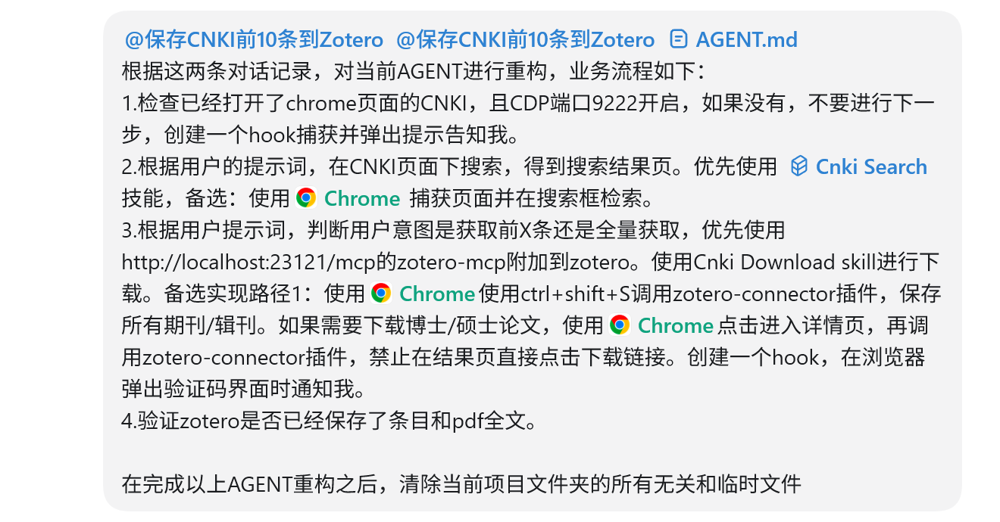
3. 扩展检索：20260701-分享我自己的人文学术论文搜索skill
这个技能需要配置许多学术搜索引擎的api，包括海外的

### 和zotero联动用处：翻译、写文献综述

配置pdf2zh

## 和obsidian联动

### obsidian介绍

**Obsidian** 是一款基于本地 Markdown 文件的**知识管理软件**，由 Shida Li 和 Erica Xu 于 2020 年发布。它被称为"第二大脑"（Second Brain）工具，核心理念是**你的数据永远属于你**——所有笔记以纯文本 Markdown（`.md`）格式存储在本地，不依赖任何云端服务。

#### 核心特性

| 特性 | 说明 |
|------|------|
| **本地优先** | 所有笔记存储在本地文件夹，完全离线可用，无需联网 |
| **双向链接** | 通过 `[[笔记名]]` 语法建立笔记之间的网状关联，而非传统的文件夹层级 |
| **关系图谱** | 可视化展示所有笔记之间的引用关系，一眼看清知识结构 |
| **插件生态** | 超过 2000 个社区插件，覆盖日历、看板、白板、数据库查询等各种场景 |
| **Markdown 原生** | 纯文本格式，可用任何编辑器打开，数据永不过时 |
| **跨平台** | Windows、macOS、Linux、iOS、Android 全覆盖，通过 iCloud/Git/Syncthing 等同步 |

#### 为什么是"第二大脑"？

传统笔记软件（如 Evernote、Notion）是"收集箱"模式——你往里面存东西，用的时候搜索。Obsidian 的哲学不同：

- **网状思维**：人脑不是文件夹层级结构，而是通过联想连接的网状结构。双向链接正是模拟这种思维模式。
- **涌现结构**：不需要预先设计分类体系，写多了自然形成知识网络
- **渐进式整理**：可以先随便写，等笔记多了再通过链接、标签、MOC（内容地图）逐步结构化

#### 与 AI Agent 的结合

Obsidian 与 AI Agent 是天作之合：

1. **本地文件 = 完美上下文**：Agent 可以直接读写 `.md` 文件，零门槛接入你的知识库
2. **结构化检索**：通过 Dataview 插件，Agent 可以像查数据库一样查询你的笔记
3. **知识图谱增强**：Agent 可以分析你的笔记网络，发现关联、推荐链接、补全知识盲区
4. **自动化工作流**：结合 Templater、QuickAdd 等插件，Agent 可以自动生成日记、周报、项目总结
5. **与 Zotero 联动**：文献笔记 + 个人思考在同一个 Obsidian 知识库中融合，Agent 可以同时理解"别人的观点"和"你的想法"

> **一句话总结**：Obsidian 是你的"离线第二大脑"，AI Agent 是你的"在线思考助手"。两者结合，你拥有一个既私密安全、又智能强大的知识管理系统。

### obsidian插件

- claudian
- git
- zotflow
- remote save

	浏览器插件：obsidian web clipper

### AI自动整理obsidian笔记

我把 Codex 接进 Obsidian，做了一个会自动整理资料的 AI 知识库

**可以直接参考这个up主的分享
https://mp.weixin.qq.com/s/Q4THoKbQmpdFg2EyjU9oDg?token=1170307989&clicktag=bar_share&scene=294&clickpos=25369&from_safari=1


20260702AI智能体实战相关提示词
不太建议加入github，因为文科的笔记会很多，git对于超过一定数量的文件的追踪性能会变差

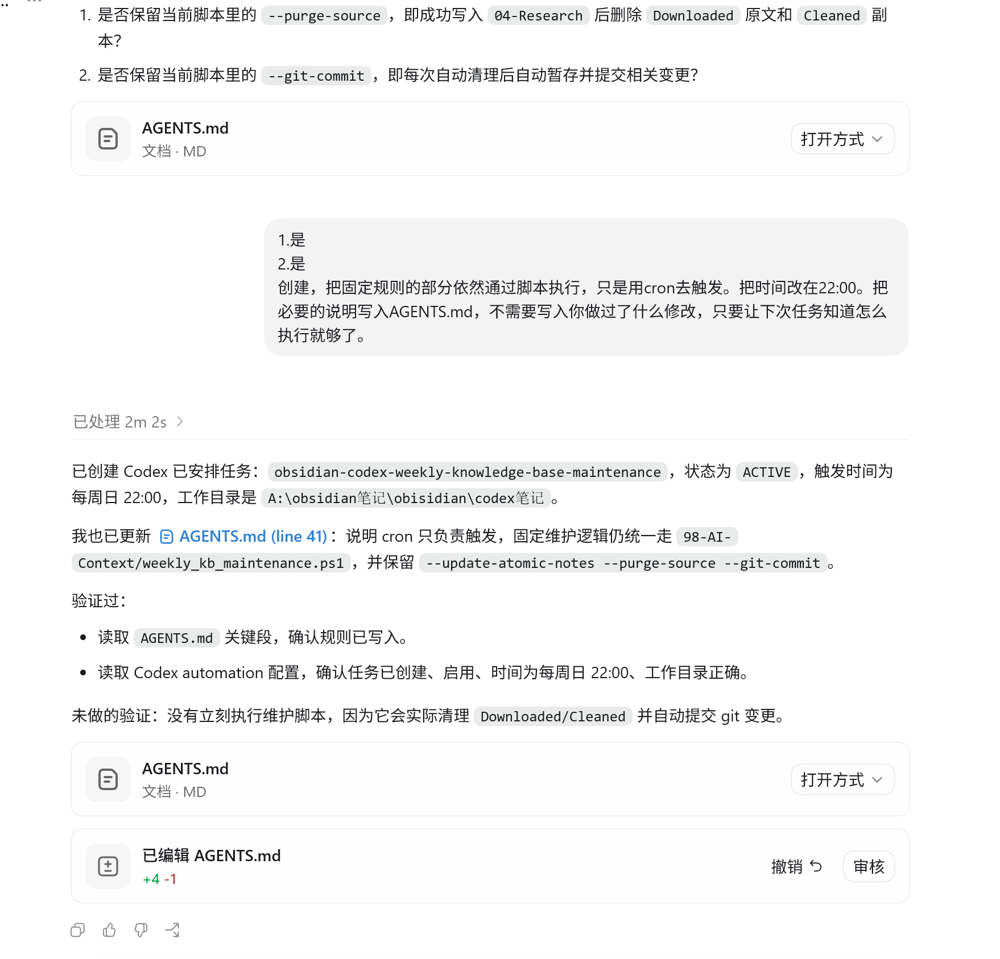
# 其他的用途可扩展（期待大家去摸索）


- 科研工作流
- 知识库
	- 为什么没有推荐知识库
		1. rag的技术原理
		2. 人文学科天然需要很大的文献库


# 总结

1. 上下文问题
2. 多接触多用
3. 把重复事项固定下来

## 展望：AI与人的关系
- AI只是一种工具
- AI的局限：上下文上线4天，C刊AI“一作”论文已从知网和官网下线_腾讯新闻
- 新时代我们需要掌握的能力：架构思维和创造力，想法很重要


